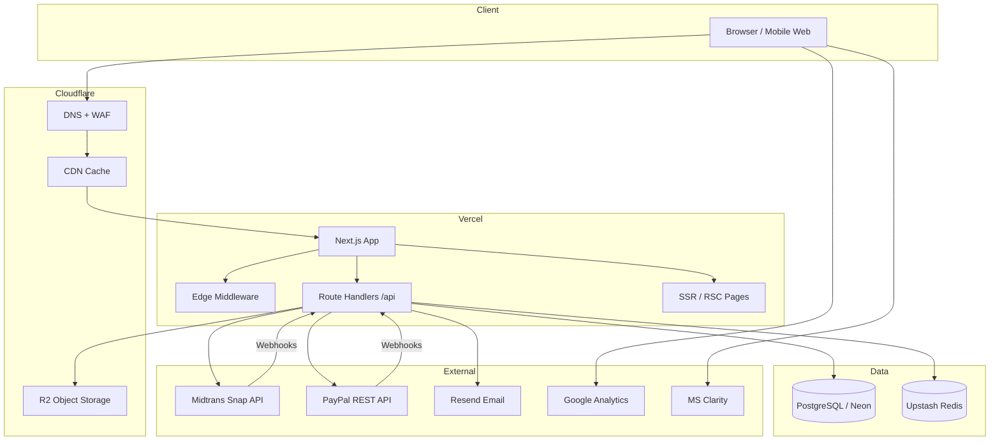

# System Architecture

## Tech Stack Recommendation

| Layer | Choice | Justification |
|-------|--------|---------------|
| **Framework** | **Next.js 16** (App Router) | Already initialized; SSR/SSG for SEO; Route Handlers replace separate API server; edge middleware for geo/rate limits |
| **UI** | React 19 + TypeScript | Type-safe components; aligns with Next.js ecosystem |
| **Styling** | Tailwind CSS 4 | Utility-first, small bundle, rapid iteration |
| **Components** | **shadcn/ui** | Accessible primitives (Radix); own the code; premium minimal aesthetic |
| **Backend** | **Next.js Route Handlers** (not NestJS for MVP) | Single deploy unit, shared types, lower ops cost; extract to NestJS only if team/complexity grows |
| **Database** | **PostgreSQL** (Neon) | Relational integrity for orders/payments; serverless-friendly branching |
| **ORM** | **Prisma** | Schema-as-code, migrations, type-safe queries |
| **Auth** | **Auth.js v5** | Native Next.js integration; credentials + session; role claims |
| **Cache** | **Upstash Redis** | Rate limiting, idempotency keys, session cart TTL |
| **Storage** | **Cloudflare R2** | S3-compatible, no egress fees; pairs with Cloudflare CDN |
| **Payments** | **Midtrans Snap** + **PayPal Checkout** | Midtrans for entity compliance; PayPal for international/CN familiarity |
| **Email** | **Resend** (`bluepearlid.com`) | Transactional email; `noreply@` sender, `support@` reply-to; SPF/DKIM/DMARC |
| **Analytics** | **GA4** + **Microsoft Clarity** | Funnel + session replay on checkout |
| **Hosting** | **Vercel** + **Cloudflare** | Vercel for app; Cloudflare DNS, WAF, R2, caching |

### Why NOT NestJS for MVP

NestJS excels at large teams and microservices. For this MVP, a monolithic Next.js app reduces:
- Deployment complexity (one artifact)
- Type duplication between frontend/API
- Cold start coordination
- Time-to-launch

**Extraction trigger:** Dedicated payment microservice when processing >500 orders/day or PCI scope changes.

---

## High-Level Architecture



---

## Application Layers

```
┌─────────────────────────────────────────────────────────┐
│  Presentation (RSC + Client Components)                 │
│  - Storefront pages, checkout wizard, admin UI            │
├─────────────────────────────────────────────────────────┤
│  Application Services                                     │
│  - OrderService, PaymentService, CartService, Catalog   │
├─────────────────────────────────────────────────────────┤
│  Domain / Validation                                      │
│  - Zod schemas, business rules, idempotency             │
├─────────────────────────────────────────────────────────┤
│  Infrastructure                                         │
│  - Prisma repos, Midtrans/PayPal clients, S3/R2, Redis  │
└─────────────────────────────────────────────────────────┘
```

---

## Request Flow Patterns

### Storefront (read-heavy)
1. RSC fetches product data on server (cached with `revalidate`)
2. Images served via `next/image` → Cloudflare CDN → R2
3. JSON-LD and metadata generated per route

### Checkout (write-critical)
1. Client submits checkout → API validates → creates `Order` (PENDING)
2. API creates `Payment` record with idempotency key
3. Redirect to Midtrans Snap or PayPal approval URL
4. Webhook confirms → transactional update Order + Inventory
5. Confirmation email via Resend (`noreply@bluepearlid.com`, reply-to `support@bluepearlid.com`)
6. Shipping confirmation email when admin marks order SHIPPED with tracking number

### Admin (protected)
1. Middleware checks session + `ADMIN` role
2. Server actions or API routes with CSRF token
3. Audit log on sensitive mutations

---

## Security Architecture

| Control | Implementation |
|---------|----------------|
| Authentication | Auth.js HTTP-only cookies, `secure`, `sameSite=lax` |
| Authorization | RBAC via `UserRole` enum; middleware route guards |
| CSRF | Built-in for Server Actions; custom token for REST mutations |
| XSS | React escaping; CSP headers via `next.config` |
| Rate limiting | Upstash `@upstash/ratelimit` on `/api/auth/*`, `/api/checkout/*` |
| Input validation | Zod on all API boundaries |
| Webhook security | Midtrans SHA512 signature; PayPal webhook ID verification |
| Idempotency | `Idempotency-Key` header → Redis 24h TTL |
| Secrets | Vercel env vars; never client-exposed |
| Audit | `AuditLog` table for admin + payment events |

---

## Caching Strategy

| Resource | Strategy | TTL |
|----------|----------|-----|
| Product listing | ISR `revalidate: 60` | 60s |
| Product detail | ISR `revalidate: 30` | 30s |
| Home featured | ISR `revalidate: 300` | 5m |
| Cart / Checkout | No cache | — |
| API webhooks | No cache | — |
| Static assets | `Cache-Control: immutable` | 1y |

---

## Observability

- **Structured logging:** `pino` with request ID correlation
- **Payment logs:** Dedicated `PaymentEvent` table (immutable)
- **Error tracking:** Sentry (recommended post-MVP week 1)
- **Uptime:** Better Uptime or Vercel monitoring on `/api/health`

---

## Environment Topology

| Environment | Purpose | Database | Payments |
|-------------|---------|----------|----------|
| `development` | Local | Docker Postgres or Neon branch | Sandbox |
| `preview` | PR previews | Neon branch | Sandbox |
| `staging` | QA / UAT | Neon staging | Sandbox |
| `production` | Live | Neon production | Live keys |
