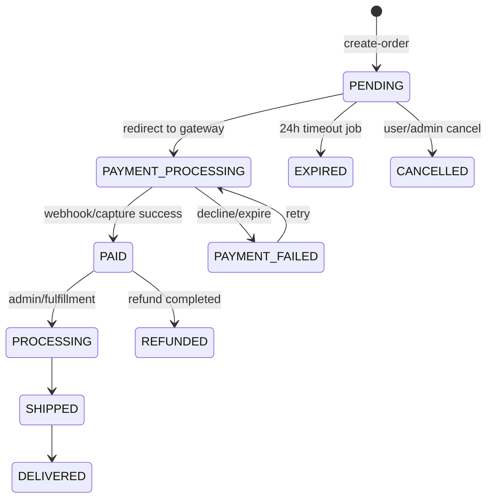
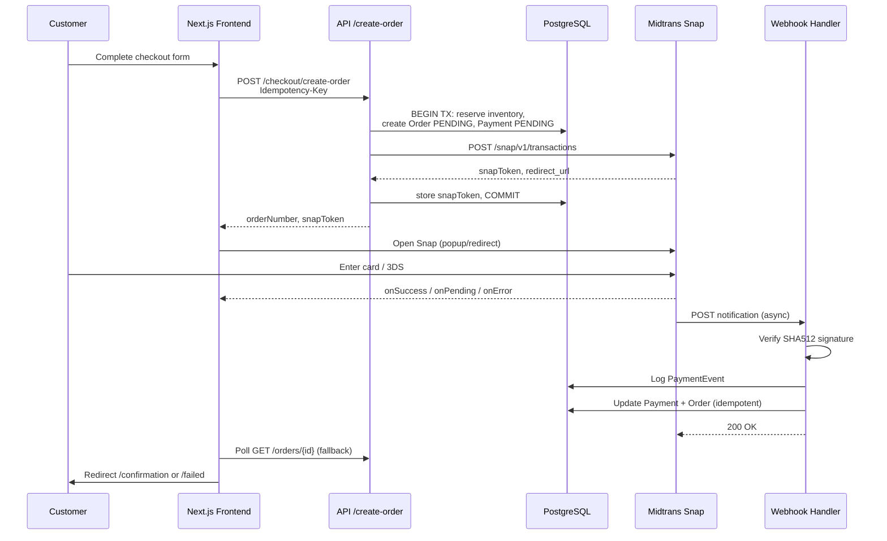
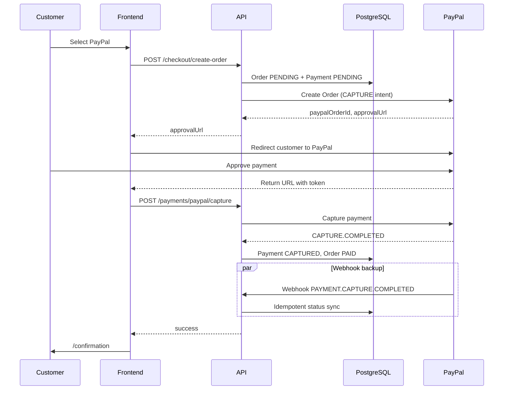
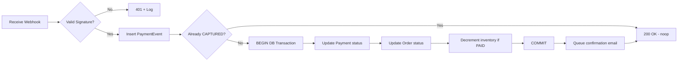
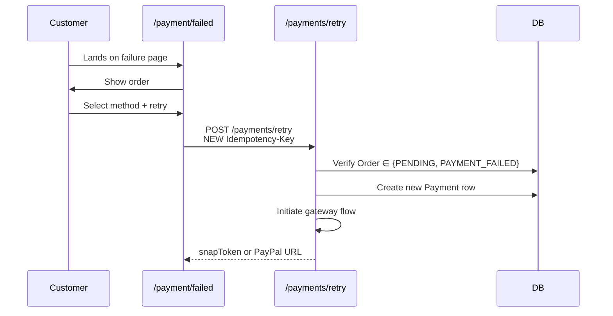
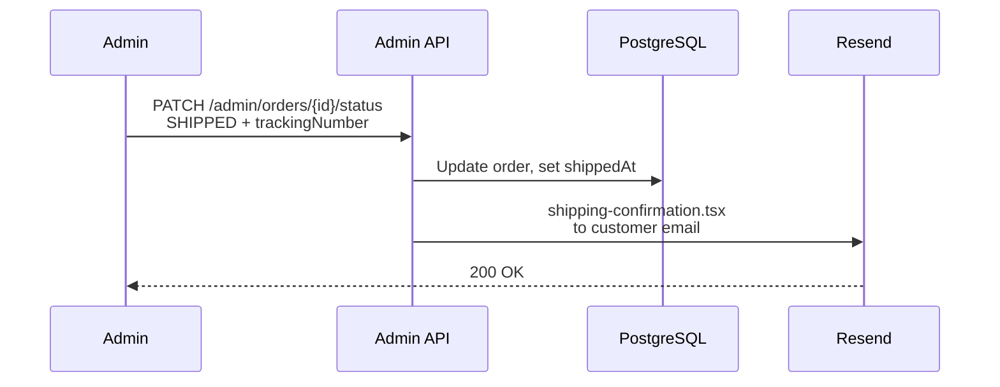

# Payment Flow Architecture

Production-grade payment design prioritizing **success rate**, **idempotency**, and **recoverability**.

---

## State Machine

### Order States



### Payment States

```
PENDING → AUTHORIZED → CAPTURED
PENDING → FAILED
PENDING → EXPIRED
CAPTURED → REFUNDED | PARTIALLY_REFUNDED
```

---

## Midtrans Snap Flow



### Midtrans Status Mapping

| Midtrans Status | Payment Status | Order Status |
|-----------------|----------------|--------------|
| `capture` (fraud accept) | CAPTURED | PAID |
| `settlement` | CAPTURED | PAID |
| `pending` | PENDING | PAYMENT_PROCESSING |
| `deny` | FAILED | PAYMENT_FAILED |
| `expire` | EXPIRED | EXPIRED |
| `cancel` | CANCELLED | CANCELLED |

---

## PayPal Checkout Flow



---

## Duplicate Transaction Prevention

```
┌─────────────────────────────────────────────────┐
│ 1. Client sends Idempotency-Key (UUID)          │
│ 2. Redis SETNX key → 24h TTL                    │
│ 3. DB unique on Payment.idempotencyKey          │
│ 4. If duplicate: return cached response         │
│ 5. Order.idempotencyKey prevents double orders  │
└─────────────────────────────────────────────────┘
```

**Rule:** Never create a second `Order` on retry — only new `Payment` linked to same `Order`.

---

## Webhook Processing Pipeline



### Webhook Reliability

| Mechanism | Detail |
|-----------|--------|
| Immediate 200 | Acknowledge before heavy work (or use queue) |
| Event log | All payloads in `PaymentEvent` before processing |
| Idempotent updates | `WHERE status NOT IN (CAPTURED, REFUNDED)` |
| Polling fallback | Cron every 5m: `PENDING` payments > 10min → query gateway status |
| Replay | Admin tool to reprocess `PaymentEvent` where `processed=false` |

---

## Payment Retry Flow



**UX rules:**
- Show "You were not charged" unless `CAPTURED`
- Allow switching method (Card → PayPal)
- Max 3 retries per order per hour (rate limit)

---

## Abandoned Checkout Recovery

1. On checkout step progress → upsert `AbandonedCheckout` with email + cart snapshot
2. Cron after 1 hour: if order still `PENDING` and no `CAPTURED` payment → send Resend email
3. Recovery link: `/checkout/recover/[token]` restores cart + pre-filled forms
4. Track `recoveredAt` for analytics

---

## Refund Flow

```
Admin initiates refund
  → API calls Midtrans/PayPal refund endpoint
  → Create Refund record (PENDING)
  → Webhook/poll confirms
  → Payment → REFUNDED, Order → REFUNDED
  → Restore inventory (optional business rule)
  → AuditLog entry

---

## Shipping Fulfillment Flow



- MVP: admin manually enters tracking number (any carrier format)
- Future: DHL, FedEx, UPS, SF Express API integration for labels + auto-tracking
```

---

## Fraud Prevention (MVP Basics)

| Control | Implementation |
|---------|----------------|
| Velocity | Max 3 failed payments per email/hour |
| Amount sanity | Reject if client total ≠ server calculation |
| AVS/CVV | Delegated to Midtrans/PayPal |
| 3DS | Enabled via Midtrans Snap defaults |
| IP logging | Store in `AuditLog` on payment create |
| Blocklist | Optional email/IP table post-MVP |

---

## Payment Logs Schema Usage

Every gateway interaction writes to `PaymentEvent`:

```json
{
  "eventType": "webhook.notification",
  "provider": "MIDTRANS",
  "payload": { "transaction_status": "settlement", ... },
  "signature": "sha512...",
  "processed": true
}
```

**Retention:** 7 years for financial audit (configurable export to cold storage).

---

## Database Tables (Payment Domain)

| Table | Purpose |
|-------|---------|
| `orders` | Commercial record; status source of truth for fulfillment |
| `payments` | One order may have multiple payment attempts |
| `payment_events` | Immutable webhook/API audit trail |
| `refunds` | Refund lifecycle |
| `abandoned_checkouts` | Recovery marketing |
| `audit_logs` | Admin actions on refunds/status |

---

## API Structure (Payment Module)

```
lib/payments/
├── midtrans.ts          # Snap token, status API, refund
├── paypal.ts            # Create, capture, refund
├── idempotency.ts       # Redis + DB helper
├── webhook-verify.ts    # Signature validators
├── order-sync.ts        # Central status transition logic
└── inventory.ts         # Reserve/release/decrement
```

**Single entry point:** `PaymentService.completePayment(paymentId, gatewayPayload)` — all webhooks and capture callbacks use this to avoid divergent logic.
