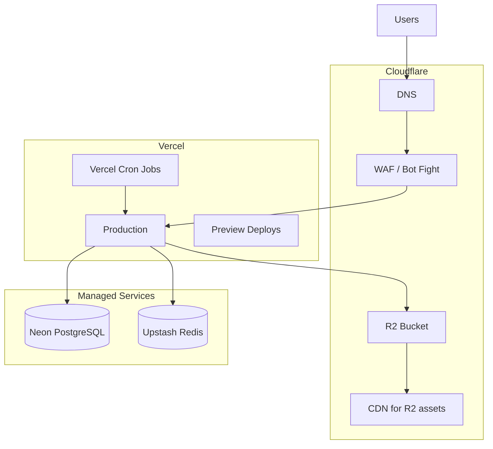

# Deployment Strategy

## Infrastructure Overview



---

## Environments

| Env | Branch | URL | Database | Payments |
|-----|--------|-----|----------|----------|
| Development | local | `localhost:3000` | Docker / Neon dev branch | Sandbox |
| Preview | PR branches | `*.vercel.app` | Neon preview branch | Sandbox |
| Staging | `staging` | `staging.bluepearl.id` | Neon staging | Sandbox |
| Production | `main` | `bluepearl.id` | Neon production | Live |

---

## Vercel Configuration

### Build Settings
- Framework: Next.js
- Node.js: 20 LTS
- Build command: `prisma generate && next build`
- Install command: `npm ci`

### Environment Variables

```bash
# Database
DATABASE_URL=
DIRECT_URL=                    # Neon pooled vs direct

# Auth
AUTH_SECRET=
AUTH_URL=https://bluepearl.id

# Redis
UPSTASH_REDIS_REST_URL=
UPSTASH_REDIS_REST_TOKEN=

# Storage (R2)
R2_ACCOUNT_ID=
R2_ACCESS_KEY_ID=
R2_SECRET_ACCESS_KEY=
R2_BUCKET_NAME=
R2_PUBLIC_URL=

# Midtrans
MIDTRANS_SERVER_KEY=
MIDTRANS_CLIENT_KEY=
MIDTRANS_IS_PRODUCTION=false

# PayPal
PAYPAL_CLIENT_ID=
PAYPAL_CLIENT_SECRET=
PAYPAL_WEBHOOK_ID=
PAYPAL_MODE=sandbox

# Email (Resend — bluepearlid.com)
RESEND_API_KEY=
EMAIL_FROM=noreply@bluepearlid.com
EMAIL_REPLY_TO=support@bluepearlid.com
EMAIL_SUPPORT=support@bluepearlid.com

# Analytics
NEXT_PUBLIC_GA_ID=
NEXT_PUBLIC_CLARITY_ID=

# App
NEXT_PUBLIC_APP_URL=https://bluepearlid.com
NEXT_PUBLIC_CURRENCY=USD
NEXT_PUBLIC_TAX_NOTICE="Import duties, VAT, and local taxes are the responsibility of the customer and may be charged upon delivery."
```

### Resend Domain Setup (1–2 days)

1. Add domain `bluepearlid.com` in Resend dashboard
2. Configure DNS records at registrar / Cloudflare:
   - **SPF** — authorize Resend sending
   - **DKIM** — domain signing (Resend-provided CNAME)
   - **DMARC** — `v=DMARC1; p=none` initially, tighten to `quarantine` post-launch
3. Verify domain in Resend
4. Send test emails from `noreply@bluepearlid.com` to major providers (Gmail, Outlook, QQ)

**Sender policy:**

| Address | Use |
|---------|-----|
| `noreply@bluepearlid.com` | Order, payment, shipping, verification emails |
| `support@bluepearlid.com` | Reply-to header; linked in email footers |

### Vercel Cron Jobs (`vercel.json`)

```json
{
  "crons": [
    { "path": "/api/cron/payment-poll", "schedule": "*/5 * * * *" },
    { "path": "/api/cron/abandoned-checkout", "schedule": "0 * * * *" },
    { "path": "/api/cron/expire-orders", "schedule": "0 2 * * *" }
  ]
}
```

---

## Cloudflare Setup

1. **DNS:** Point `bluepearl.id` to Vercel (CNAME)
2. **SSL:** Full (strict)
3. **WAF:** Enable OWASP core ruleset; rate limit `/api/auth/*`
4. **R2:** Product images bucket; public read via custom domain `assets.bluepearl.id`
5. **Caching:** Cache static assets; bypass cache for `/api/*`, `/checkout/*`

---

## Database Migration Strategy

| Stage | Action |
|-------|--------|
| Dev | `prisma migrate dev` |
| CI | `prisma migrate diff` validation |
| Staging | `prisma migrate deploy` on deploy |
| Production | `prisma migrate deploy` with manual approval gate |

**Neon features:**
- Branch per PR for isolated testing
- Point-in-time recovery (7–30 days)
- Connection pooling via `@neondatabase/serverless` or Prisma Data Proxy

---

## CI/CD Pipeline (GitHub Actions)

```yaml
# .github/workflows/ci.yml (summary)
on: [pull_request, push]
jobs:
  ci:
    - npm ci
    - prisma validate
    - npm run lint
    - npx tsc --noEmit
    - npm run test
    - npm run build
```

**Deploy flow:**
- PR → Vercel preview + Neon branch
- Merge to `staging` → staging deploy + migrate
- Merge to `main` → production deploy + migrate (with approval)

---

## Payment Go-Live Checklist

- [ ] Midtrans production keys activated
- [ ] PayPal live app approved
- [ ] Webhook URLs registered:
  - `https://bluepearl.id/api/payments/midtrans/webhook`
  - `https://bluepearl.id/api/payments/paypal/webhook`
- [ ] Test $1 real transaction on each gateway
- [ ] Verify webhook delivery in payment logs
- [ ] Confirm refund works in sandbox → then production

---

## Rollback Strategy

| Scenario | Action |
|----------|--------|
| Bad deploy | Vercel instant rollback to previous deployment |
| Bad migration | Neon PITR restore to pre-migration timestamp |
| Payment bug | Disable checkout via feature flag `CHECKOUT_ENABLED=false` |
| Gateway outage | Show banner; disable affected payment method only |

---

## Monitoring & Alerts

| Signal | Tool | Alert |
|--------|------|-------|
| 5xx rate | Vercel Analytics | > 1% for 5 min |
| Webhook failures | Custom metric | > 3 consecutive |
| Payment success rate | DB query / cron | < 85% hourly |
| DB connections | Neon dashboard | > 80% pool |
| Uptime | Better Uptime | `/api/health` down |

---

## Backup & DR

- **Database:** Neon automatic backups + weekly logical dump to R2
- **Media:** R2 versioning enabled
- **Secrets:** Documented in 1Password/Vault; rotate quarterly
- **RTO:** 4 hours | **RPO:** 1 hour (Neon PITR)

---

## Security Hardening (Production)

```typescript
// next.config.ts headers (summary)
{
  headers: [
    { key: 'X-Frame-Options', value: 'DENY' },
    { key: 'X-Content-Type-Options', value: 'nosniff' },
    { key: 'Referrer-Policy', value: 'strict-origin-when-cross-origin' },
    { key: 'Permissions-Policy', value: 'camera=(), microphone=(), geolocation=()' },
    { key: 'Strict-Transport-Security', value: 'max-age=63072000; includeSubDomains; preload' },
  ]
}
```

- CSP: restrict scripts to self + Midtrans + PayPal + GA4 + Clarity domains
- Vercel deployment protection on preview URLs

---

## Launch Sequence (Day 0)

1. **T-7 days:** Staging UAT complete
2. **T-3 days:** Production infra provisioned, secrets set
3. **T-1 day:** Final smoke test on production (maintenance mode)
4. **T-0:** Remove maintenance mode; monitor dashboards 4 hours
5. **T+1:** Review payment success rate + Clarity checkout recordings
