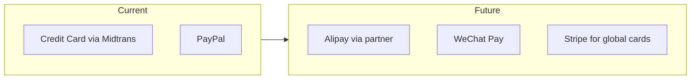

# Future Scaling Plan

Post-MVP growth strategy aligned with payment reliability and international expansion.

---

## Scaling Triggers

| Metric | Threshold | Action |
|--------|-----------|--------|
| Orders/day | > 100 | Add read replica; cache hot products |
| Orders/day | > 500 | Extract payment worker service |
| Catalog size | > 5,000 SKUs | Elasticsearch/Meilisearch |
| Traffic | > 50k daily visitors | Cloudflare aggressive caching; edge config |
| CN revenue | > 30% of GMV | Alipay/WeChat Pay via partner |
| Team size | > 3 engineers | Consider NestJS payment microservice |

---

## Phase A: Conversion Optimization (Months 1–3)

**Goal:** +10–15% checkout completion

| Initiative | Effort | Impact |
|------------|--------|--------|
| A/B test checkout step order | M | Medium |
| Apple Pay / Google Pay via Midtrans | M | High (mobile) |
| Address autocomplete (Google Places) | S | Medium |
| Zone-based shipping rates by country | M | High (intl) |
| **CNY estimated price** next to USD (display only) | S | Medium (China) |
| Carrier APIs: DHL, FedEx, UPS, SF Express | L | High |
| Post-purchase account creation | S | Low |

---

## Phase B: International Payments (Months 3–6)

**China buyer optimization:**



| Gateway | Use Case |
|---------|----------|
| **PayPal** | Primary for CN buyers with PayPal balance |
| **Stripe** | Better global card acceptance if Midtrans declines rise |
| **Alipay / WeChat Pay** | Via Cross-border PSP (e.g., PingPong, LianLian) when volume justifies |
| **Midtrans** | Retain for Indonesia entity compliance |

**Architecture change:** Payment provider abstraction interface:

```typescript
interface PaymentProvider {
  createSession(order: Order): Promise<PaymentSession>;
  capture(paymentId: string): Promise<CaptureResult>;
  refund(paymentId: string, amount: Decimal): Promise<RefundResult>;
  verifyWebhook(req: Request): Promise<WebhookEvent>;
}
```

---

## Phase C: Platform Scale (Months 6–12)

### Application Tier
- Move webhook processing to **background queue** (Inngest or BullMQ on Railway)
- Separate **read replicas** for catalog queries
- **Edge caching** for product listing JSON

### Data Tier
- Partition `payment_events` by month
- Archive completed orders > 2 years to cold storage
- Materialized view for admin analytics

### Search
- **Meilisearch** for typo-tolerant product search
- Sync via Prisma middleware or CDC

### Multi-region (if needed)
- Vercel edge functions for geo routing
- R2 multi-region or CloudFront in front of assets
- Consider Fly.io worker in Singapore for lower latency to China (limited GFW benefit)

---

## Phase D: Feature Expansion

| Feature | Priority | Notes |
|---------|----------|-------|
| i18n (EN/ZH) | High | `next-intl`; URL prefix `/zh/` |
| Multi-currency checkout | High | MVP is USD-only; CNY display-only planned |
| Region-specific tax/VAT | Medium | Duties notice at MVP; auto-calc later |
| Wishlist | Medium | |
| Product reviews (moderated) | Medium | |
| Loyalty / referrals | Low | |
| B2B wholesale portal | Low | |
| Mobile app (React Native) | Low | Reuse API |

---

## Team & Process Scaling

| Stage | Structure |
|-------|-----------|
| MVP | 1 full-stack |
| Growth | +1 frontend, +1 backend/payments specialist |
| Scale | Platform team + commerce squad |

**Payment ownership:** Dedicate one engineer as payment DRI with on-call rotation for webhook incidents.

---

## Cost Projection (Monthly)

| Scale | Vercel | Neon | R2 | Redis | Email | Total (est.) |
|-------|--------|------|-----|-------|-------|--------------|
| MVP (<1k orders) | $20 | $19 | $5 | $10 | $20 | ~$75 |
| Growth (5k orders) | $150 | $69 | $25 | $30 | $80 | ~$350 |
| Scale (20k orders) | $400 | $200 | $80 | $60 | $200 | ~$950 |

Payment gateway fees dominate at scale (2–3% GMV).

---

## Technical Debt Paydown

| Item | When |
|------|------|
| Extract `PaymentService` to standalone worker | > 500 orders/day |
| Comprehensive integration test suite | Month 2 |
| Sentry + structured logging | Launch week |
| Feature flags (LaunchDarkly or env-based) | Before A/B tests |
| API versioning `/api/v1` | Before mobile app |

---

## China-Specific Considerations (Future)

| Challenge | Approach |
|-----------|----------|
| Great Firewall latency | CDN for static assets; minimal third-party scripts |
| Local payment preference | Alipay/WeChat when volume supports onboarding |
| Language | Simplified Chinese UI; customer support WeChat QR |
| Logistics visibility | Integrate 17track or similar API |
| Compliance | Cross-border e-commerce regulations per product category |

---

## Success Metrics (12-Month)

| KPI | Target |
|-----|--------|
| Monthly GMV | 10× MVP month |
| Payment success rate | ≥ 95% |
| Checkout abandonment | < 30% |
| Repeat purchase rate | ≥ 20% |
| Page load (China VPN test) | LCP < 4s |

---

## Recommended Next Step After MVP Launch

1. **Week 1 post-launch:** Monitor payment funnel in Clarity + GA4
2. **Week 2:** Ship payment retry UX improvements based on decline codes
3. **Month 1:** Evaluate PayPal vs Midtrans success rate by country
4. **Month 2:** Decision gate on Stripe or China local payment PSP
